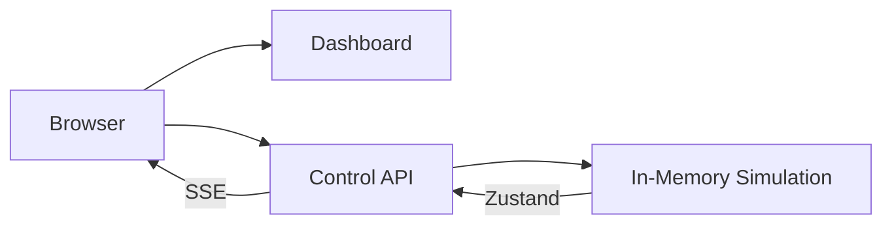
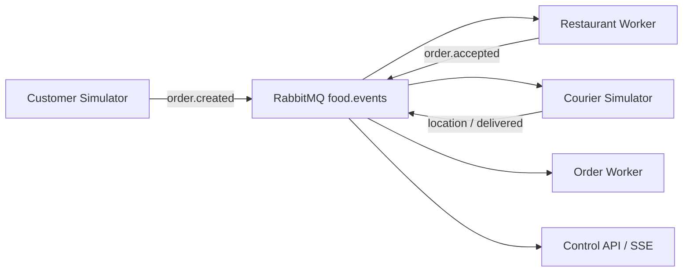
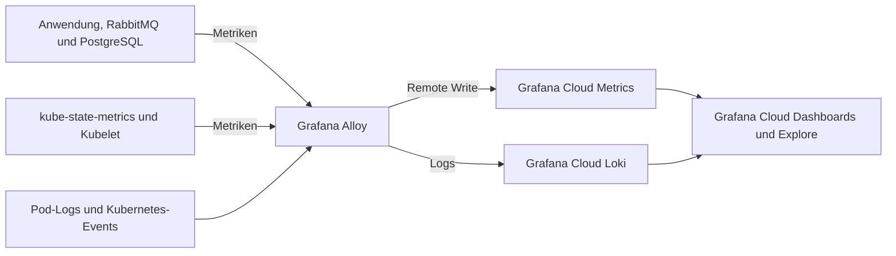

# Architektur

Die Ausbaustufen bauen aufeinander auf. Der aktuelle Stand verwendet Block 7 mit
PostgreSQL-Persistenz und Grafana Alloy für die Anbindung an Grafana Cloud.

## Block 3: Standalone

Das Dashboard und die Control API laufen als getrennte Deployments. Die Control API besitzt vorerst den In-Memory-Zustand und führt die Simulation aus.

In dieser Ausbaustufe bleibt `control-api` bei einer Replica, weil mehrere Instanzen voneinander abweichende In-Memory-Zustände hätten.

## Block 4: Ingress und Load Balancing

Traefik veröffentlicht Dashboard und API unter einem gemeinsamen Einstiegspunkt:

- `/` wird zum `dashboard`-Service geroutet.
- `/api`, `/health` und `/metrics` werden zum `control-api`-Service geroutet.
- Zwei Dashboard-Pods zeigen das Load Balancing des Services.
- Die Control API bleibt wegen des In-Memory-Zustands bei einer Replica.

## Block 5: Messaging

RabbitMQ entkoppelt die fachliche Verarbeitung:

Die Nachrichtenübertragung verwendet persistente Nachrichten, Publisher Confirms
und manuelle Acknowledgements. Nicht bestätigte Nachrichten können erneut
zugestellt werden (at-least-once). Ungültige Nachrichten und Verarbeitungsfehler
gelangen über `food.dlx` in die Dead-Letter-Queue `food.dead`.

Die beiden Order-Worker-Pods konsumieren gemeinsam die Queue `order-projection`.
In Block 5 besitzt jeder Pod nur einen lokalen Idempotenzspeicher; dieser geht
bei einem Neustart verloren und wird nicht zwischen den Pods geteilt.
RabbitMQ läuft als einzelne StatefulSet-Instanz mit persistentem Volume.

## Block 6: CloudNativePG und Persistenz

Der Order-Worker-Service schreibt den fachlichen Zustand in PostgreSQL. Seine
Replikate verwenden einen gemeinsamen Idempotenzspeicher. Neue Events werden
innerhalb einer Transaktion verarbeitet:

1. `event_id` in `processed_events` beanspruchen.
2. Relevantes Event in `order_events` ablegen.
3. Fachliche Zustandsänderung projizieren.
4. Transaktion committen und erst danach die RabbitMQ-Nachricht bestätigen.

Bereits verarbeitete Event-IDs werden ohne erneute Zustandsänderung bestätigt.

CloudNativePG verwaltet einen Primary und einen Standby auf unterschiedlichen
Kubernetes-Nodes mit eigenen persistenten Volumes. Control API und Order Worker
verwenden den Service `food-delivery-db-rw`, der nach einem Failover auf den neuen
Primary zeigt. Die Replikation ist asynchron; ein Failover garantiert deshalb
keinen verlustfreien Übergang. Die lokalen k3d-Nodes laufen auf demselben Rechner.

Die Control API läuft ab Block 6 mit zwei Replikaten. Jede Instanz lädt den
gespeicherten Zustand beim Start und gleicht ihn regelmässig mit PostgreSQL ab.
Zusätzlich empfängt sie Live-Events über eine eigene temporäre RabbitMQ-Queue
`live.<pod>` und liefert Änderungen per SSE an den Browser. Befehle und manuelle
Bestellungen werden über RabbitMQ veröffentlicht. Die Anzeige ist durch diese
asynchrone Verarbeitung nicht auf allen Instanzen jederzeit identisch.

## Block 7: Betrieb und Monitoring

Der Cluster Observer liest den Zustand der Kubernetes-Ressourcen im Namespace
`food-delivery` und stellt ihn intern über `/api/v1/components` sowie als
Bereitschaftsmetriken unter `/metrics` bereit.
Das separate HPA-Lab im Namespace `betrieb-lab` skaliert `lab-web` anhand der
CPU-Auslastung. Es verwendet den Kubernetes Metrics Server und ist unabhängig
von Grafana Cloud.

Der abgesprochene Wechsel ersetzt den lokalen Prometheus-Server durch Grafana
Alloy als Collector und Grafana Cloud als Metrikspeicher:

Alloy verwendet die vorhandenen ServiceMonitors und PodMonitors. Prometheus
Operator und kube-state-metrics bleiben dafür installiert. Der lokale
Prometheus-Server ist über `platform/monitoring/values-cloud-active.yaml`
deaktiviert. Das lokale Grafana bleibt installiert; für die aktuellen
Messwerte werden die Cloud-Dashboards verwendet.

Die Erfassung umfasst `food-delivery` und `betrieb-lab`. Eine Metrikauswahl in
`platform/alloy/config.alloy` begrenzt die Übertragung auf Anwendungsmetriken
und wichtige Betriebsdaten. Pod-Logs und Kubernetes-Events werden an Loki gesendet.

- [Betriebs-Dashboard](../platform/alloy/dispatch-city-cloud.json): Bestellungen, Pizza-Worker, Restaurant-Queues und Eventrate.
- [Infrastruktur-Dashboard](../platform/alloy/dispatch-city-infra-cloud.json): Ressourcen, Fehler, Skalierung, RabbitMQ und PostgreSQL-Replikation.

Installation und Import sind in der [Alloy-Anleitung](../platform/alloy/README.md) beschrieben.
